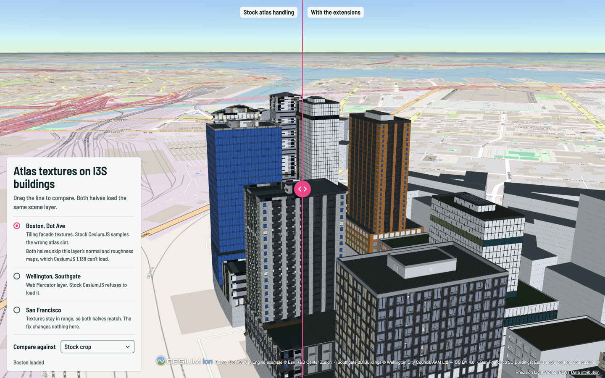
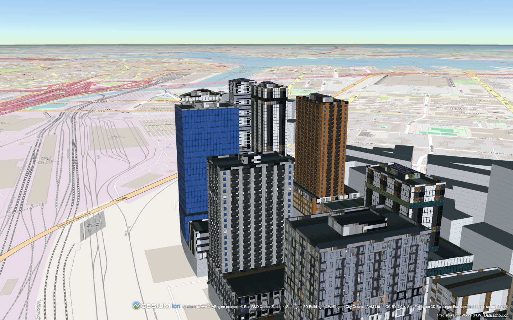
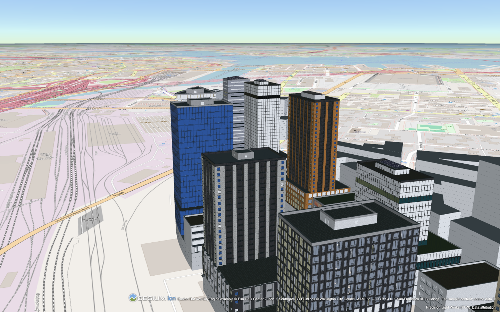

# cesium-i3s-extensions

Fixes for [CesiumJS](https://cesium.com/platform/cesiumjs/)'s I3S scene-layer support: load Web Mercator scene layers that Cesium rejects, sample atlas facade textures correctly, and load only the layers a scene is showing.



*Same scene layer, same CesiumJS 1.138 build. Left: stock atlas handling samples neighbouring atlas slots. Right: with this package.*

## What it fixes

1. **[Web Mercator scene layers](docs/01-web-mercator-i3s.md).** Loads `wkid` 102100/3857 layers that stock CesiumJS refuses with `Unsupported spatial reference`, without republishing the service.
2. **[Atlas texture sampling](docs/02-atlas-uv.md).** Remaps tiling facade UVs into their atlas region per pixel, so facades stop picking up their neighbours' textures.
3. **[No seams or shimmer](docs/03-mip-shimmer.md).** Chooses mip levels from the true texture footprint, avoiding both seams at tile edges and moiré on large flat roofs.
4. **[Load only what's shown](docs/04-layer-loading-and-cache.md).** Measured tileset defaults, and a loader that fetches a layer the first time it's made visible.

Developed by The Acceleration Agency while building ProjectGemini, a web digital-twin platform on CesiumJS. The fixes are applied at runtime to the Cesium you already import, plus one replacement worker file you build and serve; no Cesium fork is needed.

## Install

```sh
npm install @accelerationagency/cesium-i3s-extensions cesium@1.138.0
```

`cesium` is a peer dependency — install it yourself at the pinned version. The library itself (`src/`) has zero runtime dependencies; the `cesium-i3s-build-worker` CLI depends on `esbuild`.

Also add the one-line `overrides` entry from [Compatibility](#compatibility) to your own `package.json`. Without it npm can install a second copy of Cesium's engine and the viewer renders nothing.

## Quick start

Call order matters. `installProjectedI3SSupport` patches `I3SLayer`/`I3SNode` prototypes and must run before you call `I3SDataProvider.fromUrl` for the first time; `attachAtlasShader` reads the tilesets a provider already created, so it runs after `fromUrl` resolves.

```ts
import * as Cesium from 'cesium';
import {
  installProjectedI3SSupport,
  attachAtlasShader,
  i3sTilesetDefaults,
} from '@accelerationagency/cesium-i3s-extensions';

// Must run before any I3SDataProvider.fromUrl call.
installProjectedI3SSupport(Cesium);

const viewer = new Cesium.Viewer('cesiumContainer');

const provider = await Cesium.I3SDataProvider.fromUrl(sceneServerUrl, {
  cesium3dTilesetOptions: { ...i3sTilesetDefaults },
});
viewer.scene.primitives.add(provider);

// After the provider has resolved and its per-layer tilesets exist.
attachAtlasShader(provider);
```

**Every provider needs `attachAtlasShader` once the patched worker is served** — not only the ones you know use texture atlases. The patched worker no longer crops atlas UVs into their region (it forwards the region to the shader instead), so an atlas layer without the shader samples the whole atlas texture, even when all of its UVs are inside `[0,1]`. The reverse also holds: the shader without the patched worker has no region attribute to read and changes nothing. The shader is safe on non-atlas and untextured primitives (see [docs/02-atlas-uv.md](docs/02-atlas-uv.md)).

Loading more than one layer, some of them hidden until the user picks them? Use `createVisibilityLoader` instead of loading every layer up front — see [docs/04-layer-loading-and-cache.md](docs/04-layer-loading-and-cache.md):

```ts
import { createVisibilityLoader } from '@accelerationagency/cesium-i3s-extensions';

const loader = createVisibilityLoader(layerDefs, {
  onStatus(id, status, err) { /* 'deferred' | 'loading' | 'loaded' | 'failed' */ },
});
await loader.init();               // loads only the layers whose `visible` isn't false
await loader.setVisible(id, true); // loads a hidden layer on its first show
```

### Worker setup

The atlas fix and the Web Mercator fix both need a change inside Cesium's I3S decode worker, not just on the main thread — the two halves ship together or the fix is incomplete (a patched main thread against a stock worker either does nothing or produces wrong geometry). Serving the patched worker is also a commitment in the other direction: from then on, call `attachAtlasShader` on **every** `I3SDataProvider` you load, because the worker no longer crops atlas UVs and an atlas layer without the shader samples the whole atlas texture. This package ships that patch as source (`worker/decodeI3S.patch`, `worker/patched/decodeI3S.js`) plus a CLI that bundles it against *your* installed `@cesium/engine`.

Build it after your own build has copied Cesium's static assets (`Build/Cesium/{Assets,ThirdParty,Widgets,Workers}`) into the directory served at `CESIUM_BASE_URL` — this must overwrite the stock `decodeI3S.js` Cesium's own copy places there, so it needs to run after that copy step, not before it:

```sh
npx cesium-i3s-build-worker --out <dir served at CESIUM_BASE_URL>/Workers
```

Verify the worker actually being served is the patched one — in CI, after your build:

```sh
npx cesium-i3s-verify-worker <path-to-served-decodeI3S.js>
```

`cesium-i3s-verify-worker` checks for three markers (the patch banner, the `_UV_REGION_0` attribute emission, the `__projectedWkid` marker read) and exits non-zero if the served file is missing any of them — catching a build step that silently fell back to Cesium's own unpatched worker copy.

## Compatibility

| This package | cesium | @cesium/engine |
|---|---|---|
| 0.1.x | `1.138.0` exactly | `22.3.0` exactly |

Both pins are exact, not ranges. The worker build (`cesium-i3s-build-worker`, above) checks your installed `@cesium/engine` version and the sha256 of its stock `decodeI3S.js` against `worker/base.json` and refuses to run against anything else — a Cesium upgrade needs a new patch (see `CONTRIBUTING.md`), not a version bump in your lockfile.

**Duplicate-engine trap:** `cesium@1.138.0`'s own `package.json` declares `@cesium/widgets: ^14.3.0`. npm is free to resolve that range to `14.5.x`, which depends on `@cesium/engine@24`. Your project then ends up with two copies of `@cesium/engine` in `node_modules` — the one `cesium` re-exports (22.3.x) and the one `@cesium/widgets` pulls in (24.x) — and `Cesium.Viewer` silently renders nothing (`maxTextureSize` comes back `0`, `Model` picks up the wrong `FrameState` prototype, etc.). This package's own `overrides` field only protects `npm install` runs *inside this repo*; it does nothing for your project. Add the same override to your own `package.json`:

```json
{
  "overrides": {
    "@cesium/widgets": "14.3.0"
  }
}
```

(Yarn/pnpm: the equivalent `resolutions` / `pnpm.overrides` entry.)

## Before / after

Boston Dot Ave CityEngine example, both rendered by the same CesiumJS 1.138 build:





## Known issues

Stock CesiumJS 1.138 fails to load the Boston demo layer's normal-map and metallic-roughness textures at all (every tile errors in `GltfLoader` and nothing draws, with or without this package). The demo works around it by dropping both texture references before rendering, on both halves of the comparison. This package does not fix that failure — it is unrelated to atlas UVs or projected layers.

## Demo

```sh
npm run demo
```

builds the patched worker and starts a local demo at `http://localhost:5199` comparing stock CesiumJS against this package on three public ArcGIS Online scene layers. See [demo/SOURCES.md](demo/SOURCES.md) for the exact service URLs, licences, and how the layers were selected and measured.

- *Boston Dot Ave CityEngine example* © Esri R&D Center Zurich
- *Southgate 3D Buildings* © Wellington City Council, AAM Ltd — CC BY 4.0
- *San Francisco 3D Buildings*: Esri sample content; source data © Precision Light Works (PLW)

## Contributing

Contributions are welcome — see [CONTRIBUTING.md](CONTRIBUTING.md) for setup, gates, and the worker-patch workflow, and [CODE_OF_CONDUCT.md](CODE_OF_CONDUCT.md) for community standards.

## License

Apache-2.0. See [LICENSE](LICENSE) and [NOTICE](NOTICE) — the worker build embeds a modified copy of Cesium's own `decodeI3S.js`, also Apache-2.0.

Third-party: [CesiumJS](https://github.com/CesiumGS/cesium) (Apache-2.0), [draco3d](https://github.com/google/draco) (Apache-2.0) — both bundled into the worker output produced by `cesium-i3s-build-worker`.

## Contact

opensource@theaccelerationagency.com
